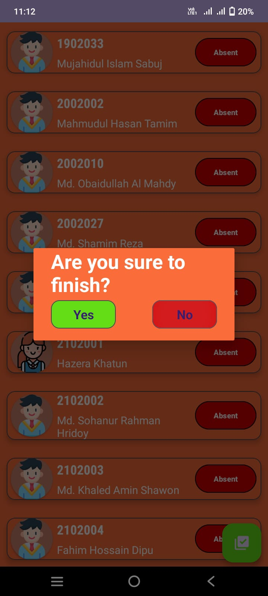
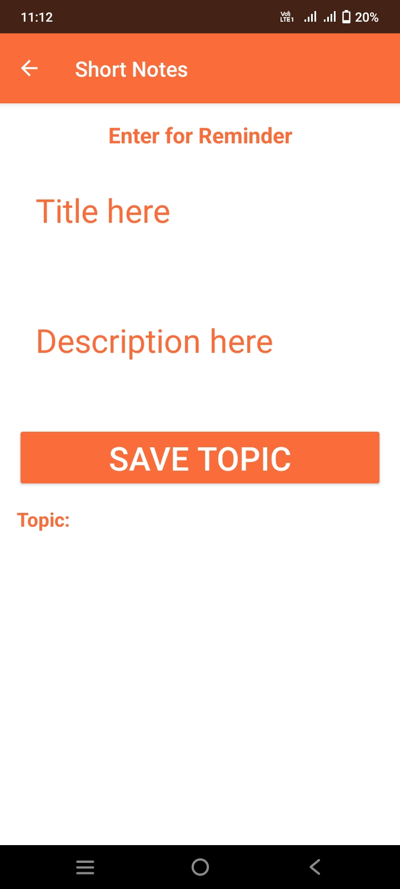
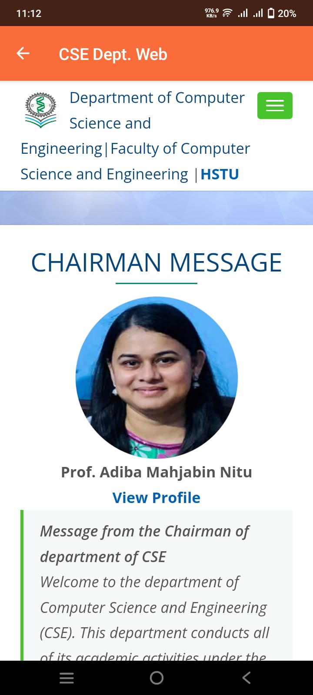

# 📚 Teacher’s Assistant App  

A mobile application designed to help teachers manage **attendance** and **reminders** efficiently. This Android app provides a simple and intuitive interface for taking attendance, updating records, and setting reminders.  

## ✨ Features  
- ✅ **Attendance Management** – Record and update attendance in Excel files.  
- ✅ **Biometric/Password Login** – Secure access for teachers.  
- ✅ **Excel File Handling** – Create, read, and update attendance data using **Apache POI**.  
- ✅ **Reminders** – Set important reminders using **Shared Preferences**.  
- ✅ **Short Notes Section** – Quickly jot down important notes.  
- ✅ **Department Web Access** – Directly access CSE department resources.  

## 🛠️ Tech Stack  
- **Language:** Java  
- **Framework:** Android SDK  
- **Data Storage:** Excel (Apache POI), Shared Preferences  
- **Authentication:** Biometric / Password-based login  

## 📸 Screenshots  







## 🚀 Installation  
1. Clone the repository:  
   ```sh
   git clone https://github.com/SRHridoy/Teacher-Assistant.git


🔥 Future Improvements
✅ Load and review attendance data for different class sessions.
✅ Add notification support for reminders.
✅ Cloud storage integration for better data backup.


🙌 Developed by Md. Sohanur Rahman Hridoy
💬 Feel free to connect and contribute!

#Java #Android #EducationTech #AttendanceManagement #OpenSource